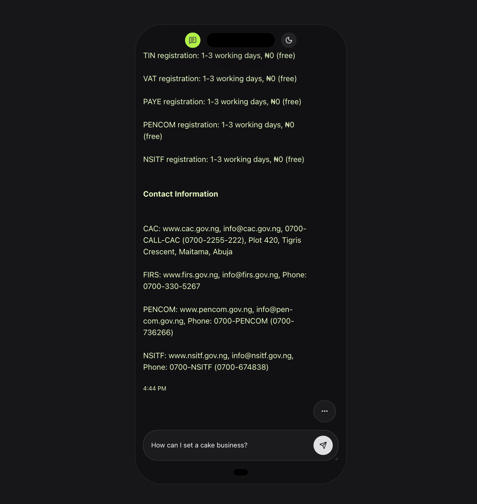
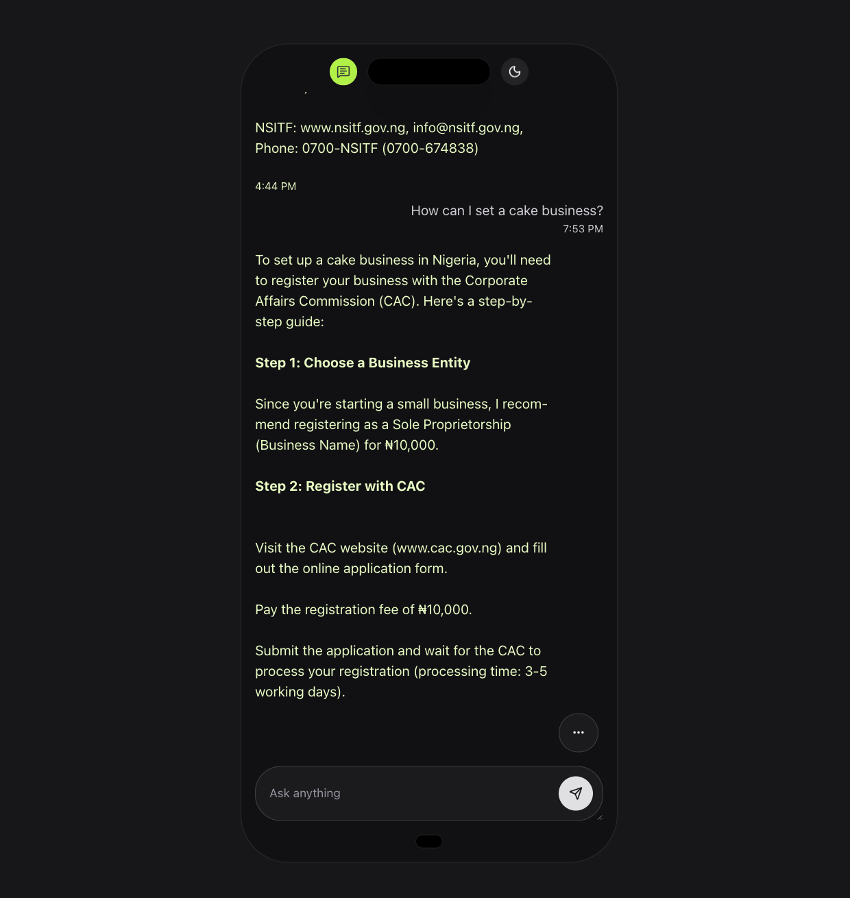
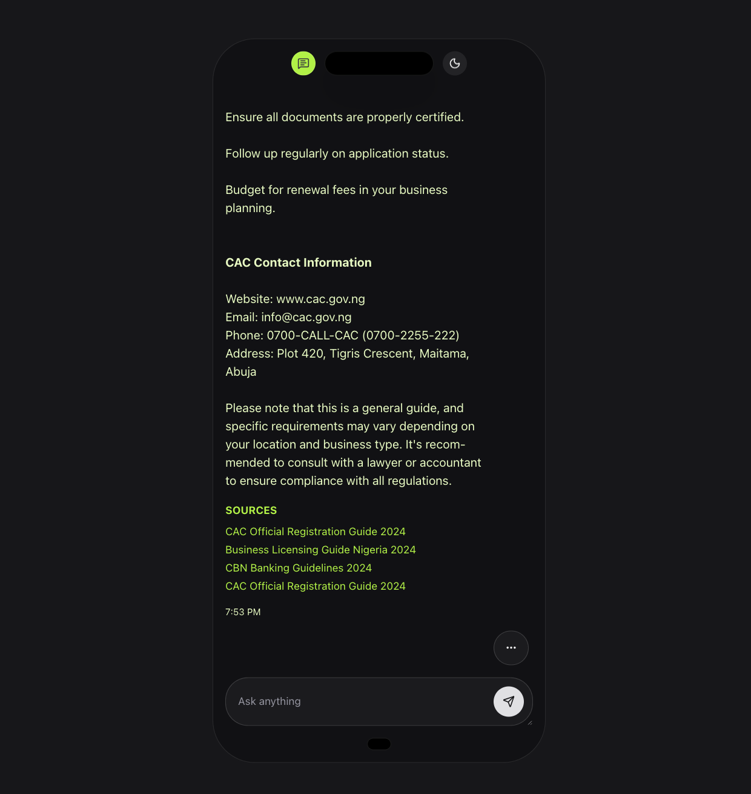

# BizBot 🤖💼

AI-powered business assistant built for the **AltSchool ML Hackathon 2025**.
BizBot is an intelligent platform that enables individuals to engage with data in a conversational way.
Designed to improve productivity, it offers valuable insights into Nigerian businesses while also providing practical guidance for starting one.

---

## 🚀 Project Overview

BizBot is designed to:

- Provide a seamless **chat interface** for business queries.
- Fetch, display, and summarize information from multiple sources.
- Store and manage **chat sessions** with proper history and citations.

---

## 🛠️ Tech Stack

- **Frontend:** Next.js 15, React, TypeScript, TailwindCSS, ShadCN UI, Framer Motion
- **State Management:** Context API + useReducer, React Query (TanStack)
- **Backend:** FastAPI, Python
- **AI Engine:** Langchain, RAG Pipeline, Nebius AI Studio
- **Database:** PostgresSQL
- **APIs & Tools:** Axios, IndexedDB

---

## 📂 Project Structure

```
/src
  ├── app/              # Next.js app router (routes, layouts, pages)
  ├── components/       # Shared UI + layout components (buttons, modals, navbar)
  ├── features/         # Feature-specific modules
  │   ├── chat/
  │   │   ├── components/
  │   │   ├── context/
  │   │   ├── db/
  │   │   ├── hooks/
  │   │   ├── services/
  │   │   └── utils/
  │   └── theme/
  ├── lib/              # Core libraries (db client, api-client, auth config)
  ├── utils/            # Generic helper functions (formatDate, parseSources)
  ├── constants/        # Static values (routes, enums, roles)
  ├── types/            # Global TypeScript types & interfaces
  └── provider/         # Global providers (notifications, TanStack, theme)
```

---

## ⚡ Features

- 💬 AI-powered chat interface with **session history**
- 📚 Source citations displayed for transparency
- 🔒 Authentication & protected routes
- 📊 Responsive, animated UI

---

<!-- ## 📜 Data Sources & Citations

- API calls and business datasets (list your specific sources here).
- Sources are parsed and attached to chat responses for validation. -->

---

## 📸 Screenshots

<table>
  <tr>
    <td></td>
    <td></td>
  </tr>
  <tr>
    <td></td>
    <td></td>
  </tr>
</table>

---

## 📹 Submission Requirements

### 1. GitHub Repository

This branch/repo contains:

- Full project code for the frontend
- Documentation (this README)
- Data sources and citations

### 2. Presentation Slide Deck

📂 [Slide Deck Link](#) (Google Slides / PPT)

### 3. Short Video Demo (5–10 mins)

🎥 [Video Demo Link](#) (YouTube / Drive)

---

## 👥 Team

- **Osezele Ejemen Iboi** – Frontend Engineer
- **Nkwor Jane** – Backend Engineer
- **Adetokun Adenike** – Cloud Engineer

---

## 🙌 Acknowledgments

- **AltSchool Africa** – Hackathon organizers
- Mentors, teammates, and the dev community
