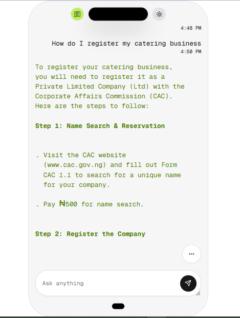

# BizBot Nigeria 🤖

An AI-powered chatbot designed to help Nigerian entrepreneurs and businesses navigate complex business registration, taxation, and trade regulations through intelligent question-answering.

## 🎯 Project Overview

BizBot Nigeria leverages Retrieval Augmented Generation (RAG) technology to provide accurate, context-aware answers to common business questions in Nigeria. Whether you're starting a new business, dealing with tax compliance, or understanding trade regulations, BizBot is your intelligent assistant.

### Problem Statement

Nigerian entrepreneurs often struggle with:

- Complex business registration processes
- Understanding tax obligations and procedures
- Navigating trade regulations and requirements
- Accessing reliable, up-to-date government information
- Language barriers in official documentation

### Solution

An AI chatbot that:

- Provides instant answers to business-related questions
- Uses official government sources and reliable business information
- Understands Nigerian business context and terminology
- Offers multilingual support for local languages
- Available 24/7 for business guidance

## 🚀 Features

- **Intelligent Q&A**: Natural language processing for business queries
- **RAG Architecture**: Retrieval-augmented generation for accurate responses
- **Nigerian Context**: Specialized knowledge of local business environment
- **Multi-source Knowledge**: Integration of CAC, FIRS, CBN, and other official sources
- **User-friendly Interface**: Simple web-based chat interface
- **Real-time Responses**: Fast query processing and response generation

## 🛠️ Tech Stack

- **Backend**: FastAPI, Python
- **Frontend**: Next.js 15, TypeScript
- **AI Framework**: LangChain, Nebius AI Studio
- **Vector Database**: FAISS
- **LLM**: Meta-Llama-3.1-8B
- **Embedding Model**: BGE-Multilingual

## 📊 Data Sources

- Corporate Affairs Commission (CAC) guidelines
- Federal Inland Revenue Service (FIRS) tax information
- Central Bank of Nigeria (CBN) regulations
- Nigerian Export Promotion Council (NEPC) trade guides
- Small and Medium Enterprises Development Agency (SMEDAN) resources
- Questions from business owners and enterpreneurs

## 🏗️ Architecture

```
[User Query] → [Web Interface] → [RAG Pipeline] → [Vector Database] → [LLM] → [Response]
```


## 📋 Project Status

**Current Phase**: Development Planning

- [x] Project conceptualization
- [x] Initial documentation
- [x] Data collection and preprocessing
- [x] RAG pipeline development
- [x] Model integration
- [x] Frontend development
- [x] Testing and evaluation
- [x] Deployment

## 🎬 Demo



## 📖 Usage

### 🔧 Backend Setup (FastAPI)

1. **Clone the repo:**

   ```bash
   git clone https://github.com/Nkwor-Jane/bizbot.git
   cd bizbot

2. Create a virtual environment:

    ```bash
    python -m venv venv
    source venv/bin/activate  # or venv\Scripts\activate on Windows

3. Install dependencies:

   ```bash
   pip install -r requirements.txt

4. Create .env file:

   ```bash
    SUPABASE_DATABASE_PASSWORD=********
    DATABASE_URL=postgresql://postgres**********************
    OPEN_API_KEY= *********************

5. Run the server:

    ```bash
    uvicorn main:app 

6. API Endpoint:

    ```bash
    POST http://localhost:8000/chat

## 🤝 Contributing

This project was developed as part of the AltSchool Africa Hackathon. Contributions and suggestions are welcome!

## 👥 Team

- **Developers**
  - **Data**: Adetokun Adenike
  - **Backend Developer**: Nkwor Jane
  - **Frontend Developer**: Osezele Ejemen
- **Institution**: AltSchool Africa
- **Hackathon**: AltSchool AFrica Hackathon

## 🙏 Acknowledgments

- AltSchool Africa for the hackathon opportunity
- Nigerian government agencies for providing public business information
- Open-source AI and ML communities for tools and frameworks

## 📞 Contact

For questions or feedback, please reach out.

---
*Last Updated: [07-09-2025]*
